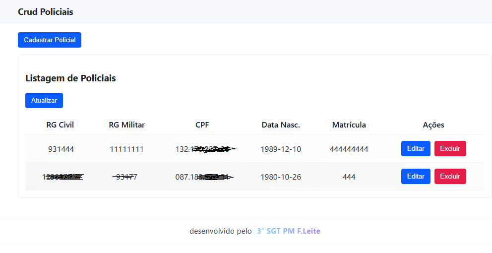
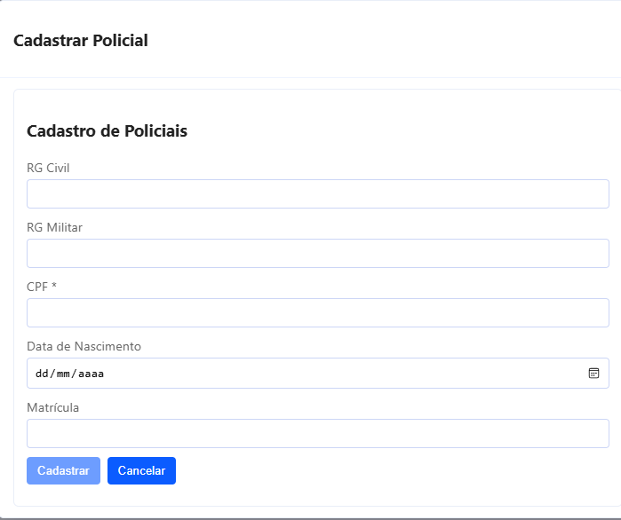

# CRUD Policiais

> Aplicação de exemplo para cadastro e listagem de policiais.


# CRUD Policiais

Aplicação de exemplo fullstack para cadastro e listagem de policiais.

Status: em desenvolvimento

Tecnologias
- Backend: Node.js + Express, mysql2, dotenv
- Frontend: Angular (standalone components), HttpClient, ngx-mask
- Banco: MySQL (script em `backend/banco.sql`)

O que o projeto faz
- Cadastro de policiais (rg_civil, rg_militar, cpf, data_nascimento, matricula)
- Validação de CPF (frontend + backend)
- Máscara de CPF no formulário (000.000.000-00)
- Criptografia AES-256-CBC da matrícula (armazenada em VARBINARY)
- Listagem, edição (PUT) e remoção (DELETE) de registros via API

Estrutura resumida
- backend/: servidor, rotas, controllers, script SQL
- frontend/app-web/: aplicação Angular (componentes em `src/app/shared`)

Configuração do ambiente
1. Copie o arquivo `.env.example` para `backend/.env` e ajuste as variáveis (DB_*, MATRICULA_SECRET, PORT).

Exemplo (.env):
```
DB_HOST=localhost
DB_USER=root
DB_PASS=123456
DB_NAME=seguranca
JWT_SECRET=seusegredojwt
MATRICULA_SECRET=chaveSecreta123
PORT=3049
```

Importante: `MATRICULA_SECRET` é usada para derivar a chave AES. Se for alterada após ter gravado dados, a descriptografia poderá falhar (`ERR_OSSL_BAD_DECRYPT`). Em produção, implemente IV aleatório por registro.

Preparar o banco
1. Crie o banco/usuário conforme `.env`.
2. Execute o script SQL (PowerShell):

```powershell
mysql -u root -p seguranca < backend/banco.sql
```

Rodando o backend
1. Instale dependências e inicie (PowerShell):

```powershell
cd backend
npm install
npm start
# servidor padrão: http://localhost:3049
```

Rodando o frontend
1. Instale dependências e rode o dev server (PowerShell):

```powershell
cd frontend\app-web
npm install
npm start
# frontend padrão: http://localhost:4200
```

API principais
- GET  /api/policiais — lista todos (opcional: ?cpf=... ou ?rg=...)
- POST /api/policiais — cria um policial
- PUT  /api/policiais/:id — atualiza um policial
- DELETE /api/policiais/:id — remove um policial

Payload exemplo (POST/PUT):
```json
{
  "rg_civil": "123456789",
  "rg_militar": "987654321",
  "cpf": "12345678909",
  "data_nascimento": "1990-05-20",
  "matricula": "ABC123"
}
```

Notas rápidas sobre o frontend
- O componente de cadastro (`CadpoliciaisComponent`) é usado tanto para criar quanto para editar (quando recebe `initial` via input).
- A listagem (`ListaPoliciaisComponent`) usa a pipe `cpfFormat` para exibir CPF como `000.000.000-00`.
- O CPF é limpo (apenas dígitos) antes de ser enviado ao backend.

Observações de segurança
- Atualmente a criptografia usa IV fixo (implementação simples). Para produção, gere um IV aleatório por registro e armazene-o junto ao ciphertext.
- Se precisar migrar dados criptografados quando mudar a estratégia de IV/chave, implemente um script de migração que faça decrypt com a chave antiga e re-encrypt com a nova estratégia.

Diagnóstico e dicas
- Se `DELETE` ou `PUT` retornarem 404, verifique se o backend foi reiniciado após alterações de rota.
- Erro `bad decrypt`: verifique `MATRICULA_SECRET` e se foi alterada após gravação dos dados.
- Problemas de conexão com banco: verifique `DB_*` e se o MySQL está ativo e aceitando conexões.

Próximos passos recomendados
- Implementar IV aleatório por registro e migração de dados.
- Adicionar testes automatizados (unit / e2e).
- Melhorar feedback do frontend (toasts) e controles de validação mais explícitos.

Contribuindo
- Pull requests são bem-vindos. Para mudanças grandes, abra uma issue primeiro.

Licença
- ISC

Imagens
------
Screenshots e imagens de exemplo do projeto (armazenadas em `assets/`). Se você fez upload das imagens para `assets/`, elas serão exibidas abaixo:




